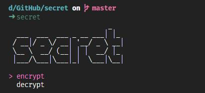
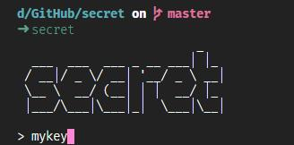
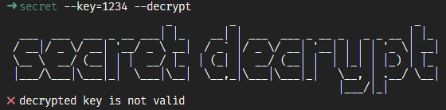
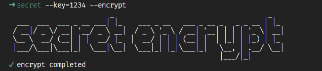
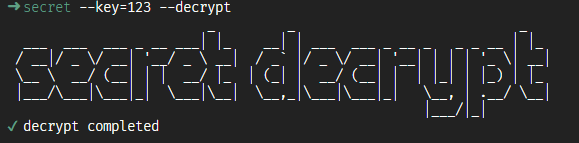

# 💭 secret

<p align="center">

</p>
<p align="center"><a href="https://www.npmjs.com/package/@simon_he/secret"></a>
</p>
<p align="center"><a href="https://www.npmjs.com/package/@simon_he/secret">
<a href="https://github.com/Simon-He95/secret">
</a>
</a>
</p>

灵感启发于[geekris1/funnycode](https://github.com/geekris1/funnycode), 实现一种代码的加密和解密方式。

## 🔅 场景
也许你不想share你的代码到仓库,你可以在提交前去加密,这样在仓库里的代码则是加密的代码,如果在公司要离职了,你留下的提交记录都是注释了哦:smirk:

## :zap: 特性
这个密码是跟着你的电脑来的， 所以一旦你设定了一个初始密码之后, 之后的加密和解密都是基于这个初始密码的。所以难以泄露, 也无需担心这个密码忘记导致解码失败，之后的加密和解密都无需再次输入初始密码。这个密码会生成在该用户的下的secret_key.txt中。

## 🚀 安装
```bash 
  npm install -g @simon_he/secret
```
## :question:如何使用
- 选择encrypt或者decrypt 来进行加密或者解密
- 需要输入一个加密的密码



## 🔧 用法
- 🔒  加密 : 需要指定一个key,作为解密的密钥



- 🔓  解密 : 需要指定一个key,作为解密的密钥


## 😏 技巧
- key可在package.json中提前配置
- includes可配置需要被加密的目录或文件类型
- ignore可配置需要忽略的目录或文件类型,目前会自动忽略.jpg | .png | .gif类型文件,如果有更多需要可配置在ignore中

```bash
  "secret": {
    "key": "123",
    "includes": [
      "**/*.js",
      "**/*.json"
    ],
    "ignore": []
  }
```

## ⚠ 提醒:
- 以防突发的错误导致代码的丢失, 请提前做一个备份 :)

## 🤐  常见状态:
- 错误的key



- 正确的加密



- 正确的解密



