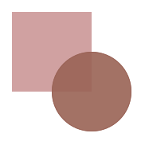

<p align="center">

</p>
<p align="center"><a href="https://www.npmjs.com/package/@simon_he/secret"></a></p>

## secret
灵感启发于[geekris1/funnycode](https://github.com/geekris1/funnycode), 实现一种代码的加密和解密方式。

## 场景
也许你不想share你的代码到仓库,你可以在提交前去加密,这样在仓库里的代码则是加密的代码,如果在公司要离职了,你留下的提交记录都是注释了哦:)

## 安装
```bash 
  npm install -g @simon_he/secret
```

## 用法
- 加密 : 需要指定一个key,作为解密的密钥

```bash
  secret --key=123
```

- 解密 : 需要指定一个key,作为解密的密钥

```bash
  secret --key=123 --decrypt
```

## 技巧
- key可在package.json中提前配置
- includes可配置需要被加密的目录或文件类型
- ignore可配置需要忽略的目录或文件类型,目前会自动忽略.jpg | .png | .gif类型文件,如果有更多需要可配置在ignore中

```bash
  "secret": {
    "key": "123",
    "includes": [
      "**/*.js",
      "**/*.json"
    ],
    "ignore": []
  }
```

## 提醒:
- 以防突发的错误导致代码的丢失, 请提前做一个备份 :)

## 常见状态:
- 错误的key


- 正确的加密


- 正确的解密


